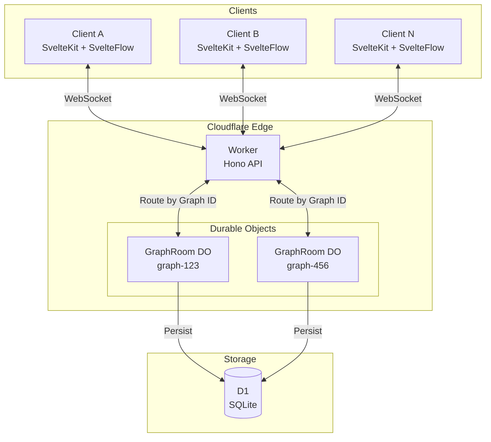
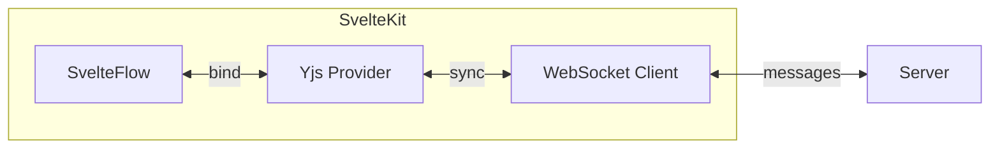
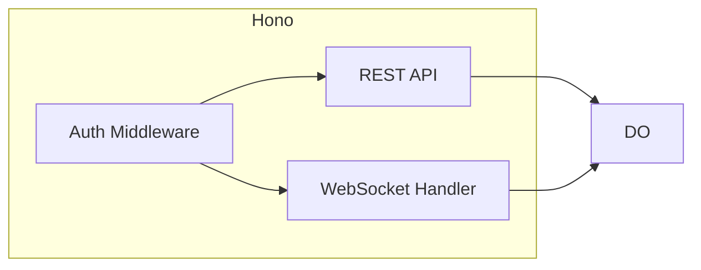
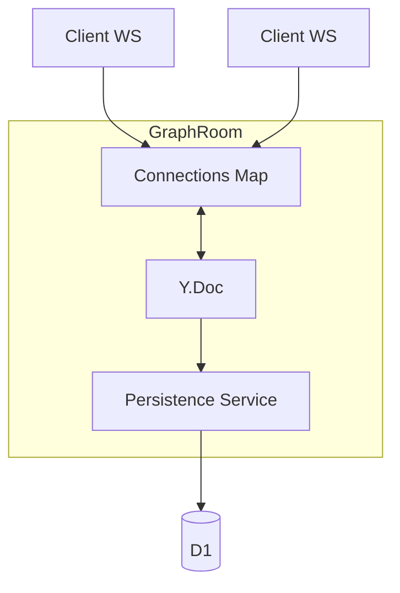

# Overview

SvelteFlowベースのNode-Edgeモデルをリアルタイムコラボレーションで操作するシステム。
CRDTを採用し、Cloudflare Durable Objectsで状態管理を行う。

## System Architecture

## Component Details

### Client (packages/ui)

- **SvelteFlow**: Node-Edge UIコンポーネント
- **Yjs Provider**: ローカルY.Docを管理
- **WebSocket Client**: サーバーとの同期

### Worker (packages/core)

- **REST API**: グラフ一覧、作成、削除
- **WebSocket Handler**: リアルタイム接続の確立
- **Auth Middleware**: 認証・認可

### Durable Object (GraphRoom)

- **Y.Doc**: CRDTドキュメント（ノード、エッジ、メタデータ）
- **Connections Map**: 接続中クライアントの管理
- **Persistence Service**: D1への永続化（デバウンス付き）

## Key Design Decisions

| 項目 | 選択 | 理由 |
|------|------|------|
| 整合性モデル | CRDT (Yjs) | コンフリクト自動解決、オフライン対応 |
| 通信 | WebSocket | 双方向リアルタイム、Cloudflare対応 |
| 状態管理 | Durable Objects | グラフ単位の分離、WebSocket管理 |
| 永続化 | D1 + Yjs snapshot | SQLiteベース、Yjs状態をblobで保存 |
| 配信範囲 | 変更差分のみ | Yjsのupdate encodingで自動最適化 |
