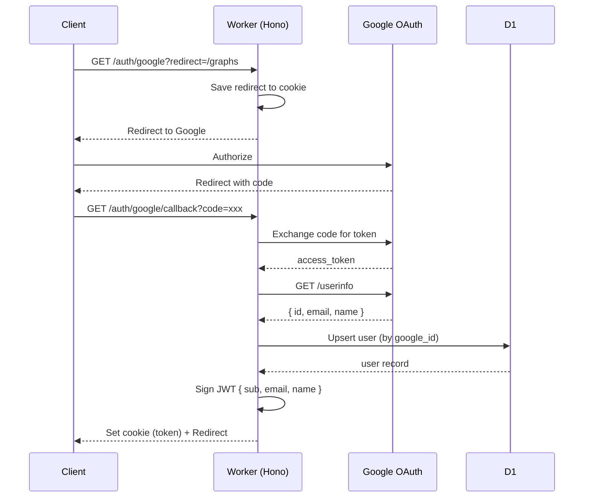

# Authentication

## Google OAuth Flow

## URL設計

| パス | 用途 |
|------|------|
| `/` | ランディングページ（未ログインOK） |
| `/login` | ログインページ |
| `/auth/google` | Google OAuth開始 |
| `/auth/google/callback` | OAuthコールバック |
| `/graphs` | グラフ一覧（要ログイン） |
| `/graphs/:id` | グラフ編集（要ログイン + WebSocket） |

## セッション管理

| 項目 | 値 |
|------|-----|
| 方式 | JWT (cookie) |
| 有効期限 | 7日 |
| 保存場所 | HttpOnly cookie |
| ユーザー識別 | `google_id` (不変) |

## Google OAuth設定

Google Cloud Consoleで2つのOAuthクライアントを作成:

| クライアント名 | 用途 | リダイレクトURI |
|---------------|------|-----------------|
| think-graph-local | ローカル開発 | `http://localhost:3000/auth/google/callback` |
| think-graph-prod | 本番 | `https://your-domain.com/auth/google/callback` |

### 設定手順

1. [Google Cloud Console](https://console.cloud.google.com/) にアクセス
2. プロジェクトを作成（または選択）
3. 「APIとサービス」→「認証情報」
4. 「認証情報を作成」→「OAuth クライアント ID」
5. アプリケーションの種類:「ウェブ アプリケーション」
6. 承認済みの JavaScript 生成元: `http://localhost:3000`
7. 承認済みのリダイレクト URI: `http://localhost:3000/auth/google/callback`
