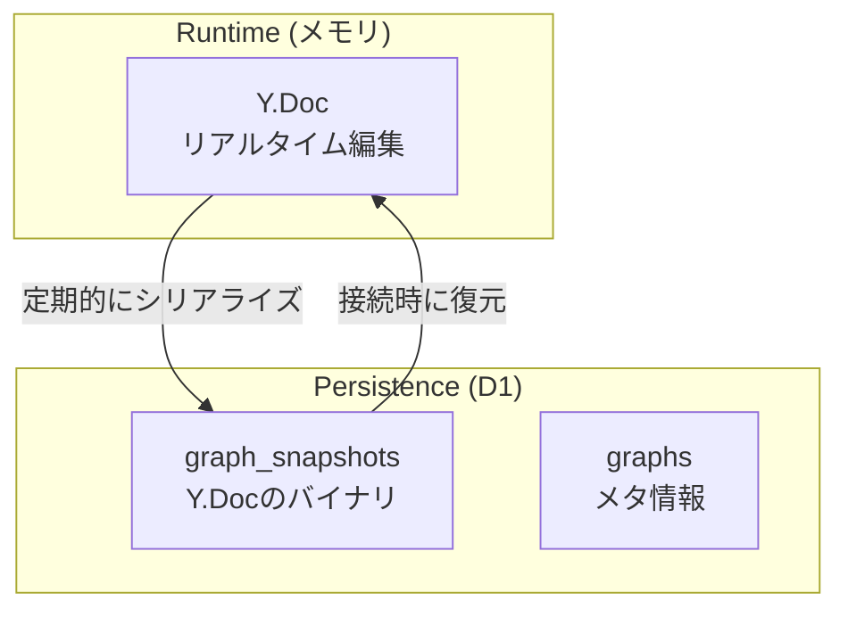
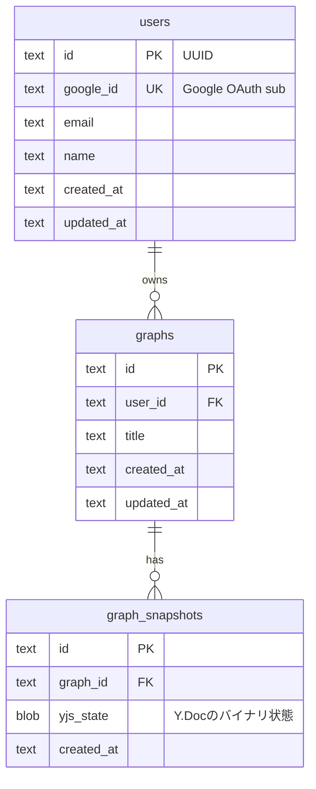
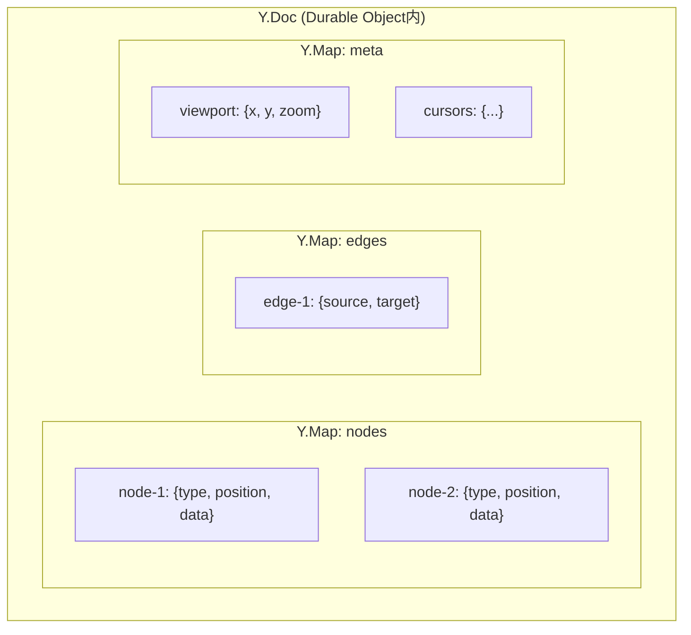
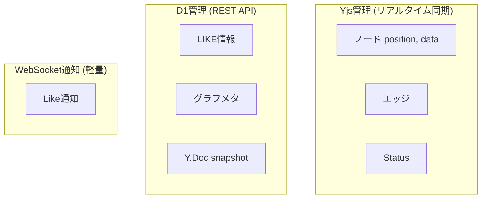
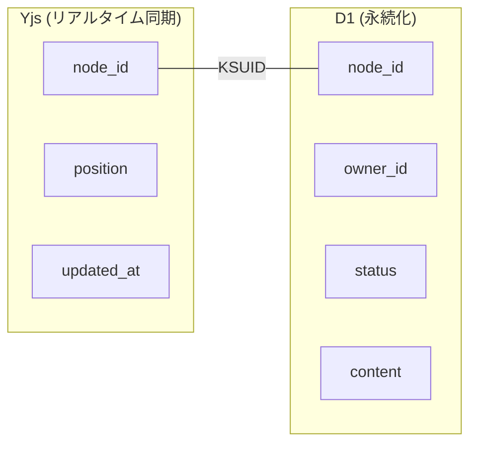

# Data Model

## Storage Strategy

2つのデータ層で役割を分離する。



| 層 | 用途 | データ |
|---|------|--------|
| **Y.Doc** | リアルタイム編集・同期 | ノード、エッジ、カーソル |
| **D1** | 永続化・メタ管理 | Y.Docスナップショット (blob) |

ノード・エッジはD1のカラムに分解せず、Y.Docを丸ごとblobで保存。
検索が必要になったPhaseで正規化テーブルを追加検討。

## D1 Schema



## CRDT Structure (Y.Doc)

リアルタイムで同期されるインメモリ構造。



```typescript
// コード例
const ydoc = new Y.Doc()
const nodes = ydoc.getMap('nodes')
const edges = ydoc.getMap('edges')

// ノード追加
nodes.set('node-1', { type: 'default', position: { x: 100, y: 200 }, data: {} })

// この変更が自動的に他クライアントに差分配信される
```

## Data Separation

リアルタイム同期が必要なデータとそうでないデータを分離する。



### ノードデータの所有権分離

YjsとD1で管理するデータを明確に分離し、共通のnode_id (KSUID) で紐づける。



| フィールド | 管理元 | 理由 |
|-----------|--------|------|
| `node_id` | 共通 (KSUID) | YjsとD1の紐付け、時系列ソート可能 |
| `position` | **Yjs** | ドラッグ等リアルタイム同期必須 |
| `updated_at` | **Yjs** | コンテンツ更新の通知トリガー |
| `owner_id` | **D1** | 不変、リアルタイム同期不要 |
| `status` | **D1** | 更新頻度低、フェッチで十分 |
| `content` | **D1** | サイズ大、同時編集不要 |

### ID設計

```typescript
import ksuid from 'ksuid'
const nodeId = ksuid.randomSync().string
// "2K5hM8H3xNlPQzY1L9WvRt0Jq4a" (27文字)
```

**KSUIDを採用する理由:**
- 時系列ソート可能 → D1のB-treeインデックス効率◎
- クライアント側で生成可能 → オフライン対応
- UUIDより短い (27文字)

**ユーザーIDのみUUID:**
- `google_id` で検索するためKSUIDの時系列ソート不要
- `crypto.randomUUID()` (Workers標準API) で追加依存なし
