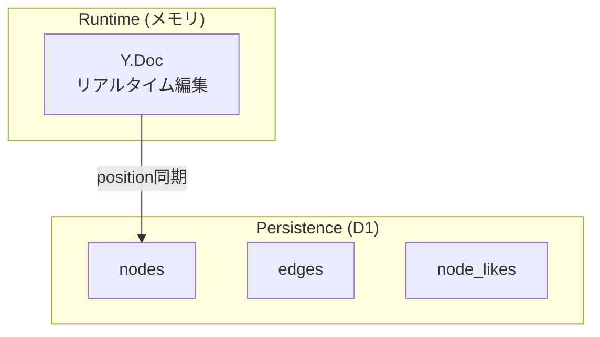
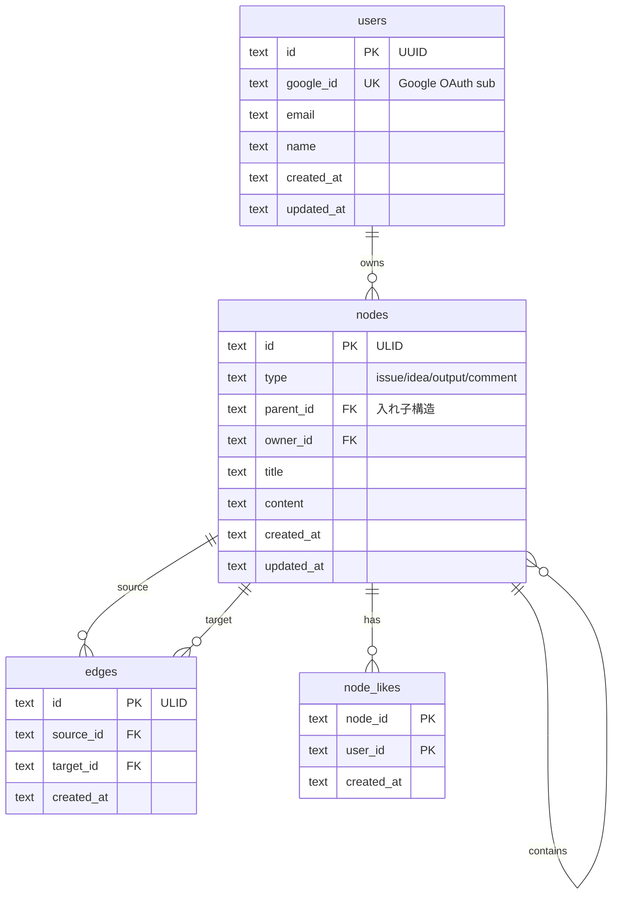
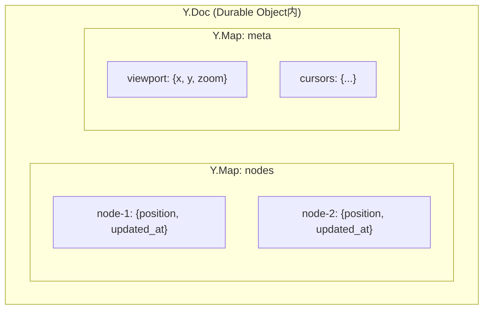
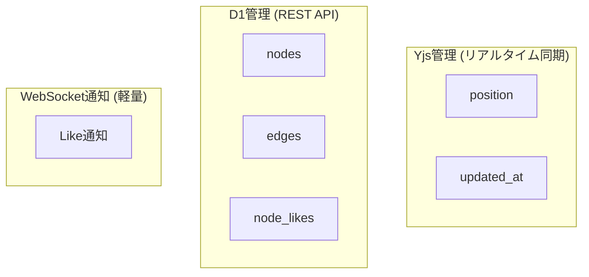
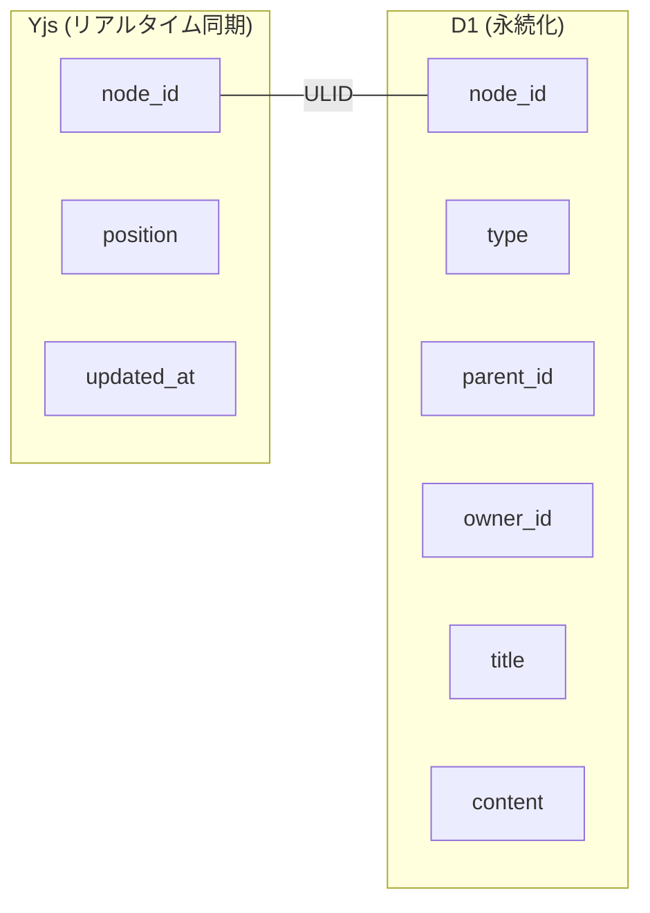

# Data Model

## Storage Strategy

2つのデータ層で役割を分離する。



| 層 | 用途 | データ |
|---|------|--------|
| **Y.Doc** | リアルタイム編集・同期 | position, updated_at |
| **D1** | 永続化・メタ管理 | ノード、エッジ、Like |

全ユーザー共通の空間を共有。将来的に招待・認可機能で複数ボードに拡張予定。

## D1 Schema



## Node Types

| type | 用途 |
|------|------|
| `issue` | 課題・問題 |
| `idea` | アイデア・提案 |
| `output` | 成果物・結論 |
| `comment` | コメント |

各タイプ固有の機能は将来拡張可能（専用メタデータテーブル追加など）。

## Parent-Child Structure

ノードは親子関係を持ち、入れ子構造を表現できる。

```
Node A (parent)
├── Node B (parent_id = A)
├── Node C (parent_id = A)
│   └── Node D (parent_id = C)
└── Comment (parent_id = A, type = comment)
```

SvelteFlowの `parentId` と対応。子ノードは親からの相対位置で配置される。

## CRDT Structure (Y.Doc)

リアルタイムで同期されるインメモリ構造。



```typescript
// コード例
const ydoc = new Y.Doc()
const nodes = ydoc.getMap('nodes')

// 位置更新（リアルタイム同期）
nodes.set('node-1', { position: { x: 100, y: 200 }, updated_at: Date.now() })
```

## Data Separation

リアルタイム同期が必要なデータとそうでないデータを分離する。



### ノードデータの所有権分離

YjsとD1で管理するデータを明確に分離し、共通のnode_id (ULID) で紐づける。



| フィールド | 管理元 | 理由 |
|-----------|--------|------|
| `node_id` | 共通 (ULID) | YjsとD1の紐付け、時系列ソート可能 |
| `position` | **Yjs** | ドラッグ等リアルタイム同期必須 |
| `updated_at` | **Yjs** | コンテンツ更新の通知トリガー |
| `type` | **D1** | ノード種別 |
| `parent_id` | **D1** | 入れ子構造 |
| `owner_id` | **D1** | 不変、リアルタイム同期不要 |
| `title/content` | **D1** | 編集はオーナーのみ |

### ID設計

```typescript
import { ulid } from 'ulid'
const nodeId = ulid()
// "01ARZ3NDEKTSV4RRFFQ69G5FAV" (26文字)
```

**ULIDを採用する理由:**
- 時系列ソート可能 → D1のB-treeインデックス効率◎
- `crypto.getRandomValues()` ベースで Workers 対応
- UUIDより短い (26文字)

**ユーザーIDのみUUID:**
- `google_id` で検索するためULIDの時系列ソート不要
- `crypto.randomUUID()` (Workers標準API) で追加依存なし
