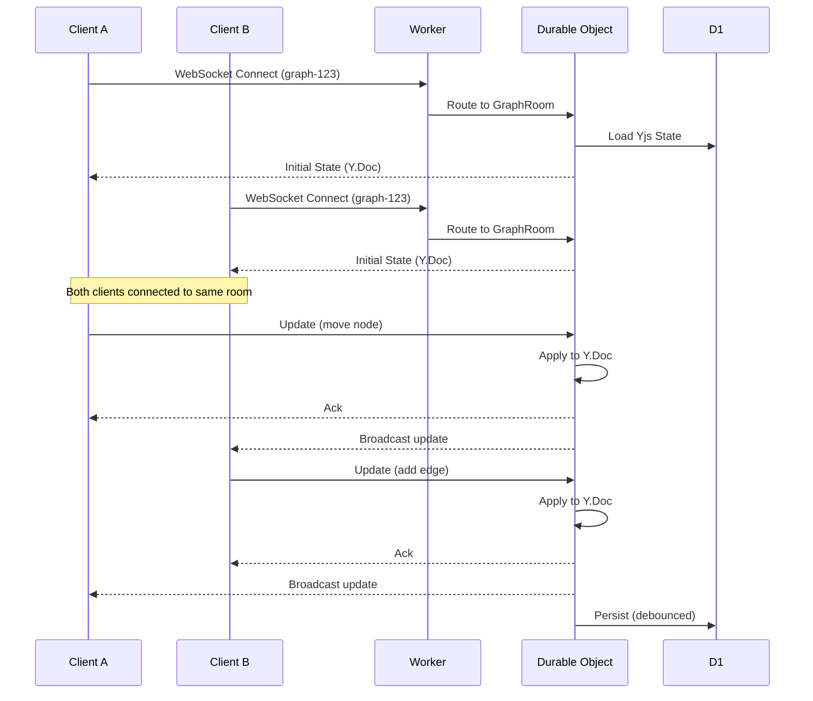
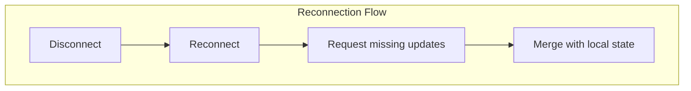
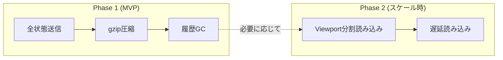
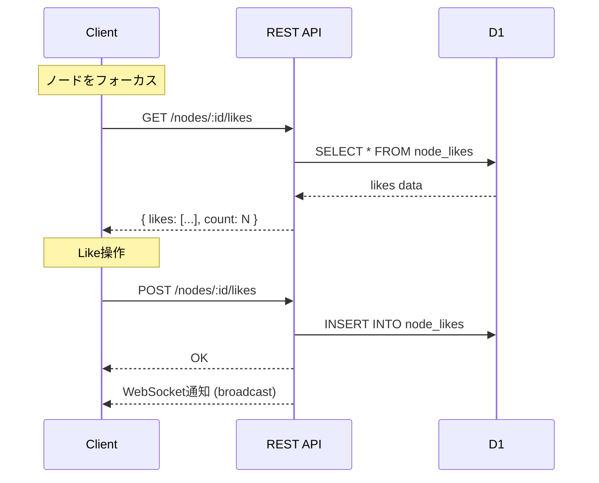
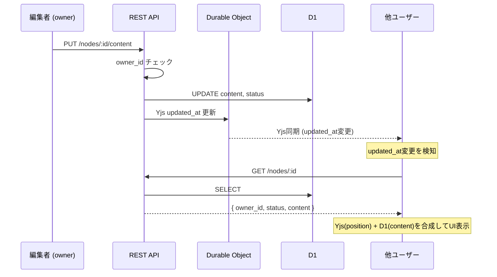
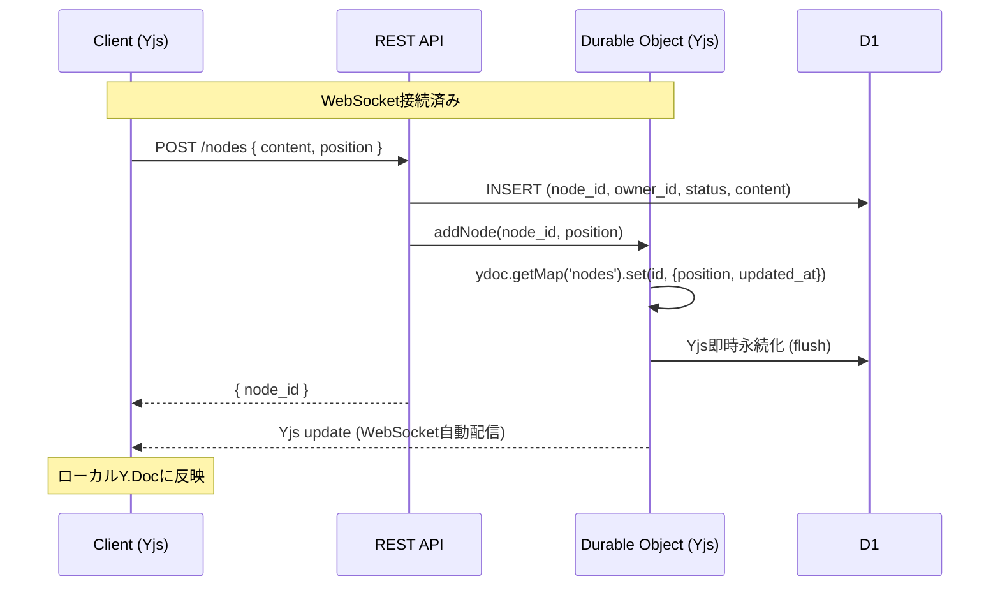

# Realtime Sync

## Data Flow

## Failure Handling

- **切断時**: ローカルY.Docで継続編集可能
- **再接続時**: 差分同期でマージ
- **コンフリクト**: CRDTが自動解決

## Data Transfer Optimization

### 配信データ量

| タイミング | 配信内容 | サイズ |
|-----------|---------|--------|
| **更新時** | 変更差分のみ (Yjs update) | 数十バイト〜数KB |
| **初期接続** | 全状態 (Y.Doc snapshot) | ノード数に比例 |

### 最適化戦略

**Phase 1 (MVP):**
- 初期接続時は全状態をgzip圧縮して送信
- Y.Docの履歴をGCしてサイズ削減
- 更新時はYjsの差分配信（自動）

**Phase 2 (大規模グラフ対応):**
- Viewport内のノードのみ先に送信
- 残りは遅延読み込み
- サブドキュメント分割を検討

## LIKE情報の取得フロー

クライアント側でLike情報をメモリ保持せず、フォーカス時にオンデマンド取得。

**メリット:**
- 不要なデータをメモリ保持しない
- 大量ノードでもクライアント軽量
- Like詳細は必要なときだけ取得

## コンテンツ更新フロー

**ポイント:**
- Yjsのデータ → Yjsから取得 (REST APIで返さない)
- D1のデータ → REST APIで取得 (Yjsに含めない)
- クライアント側で合成して表示

## ノード作成フロー

ノード作成はREST API経由で行い、D1とYjsの整合性を保証する。

**整合性保証:**
- D1とYjsをサーバー側で同時に更新
- ノード作成時はデバウンスせず即時永続化
- クライアントはWebSocket経由でYjs更新を自動受信

## クライアント側の操作範囲

| 操作 | 方法 | 理由 |
|------|------|------|
| ノード作成 | REST API | D1/Yjs整合性のため |
| ノード削除 | REST API | 同上 |
| 位置変更 | Yjs直接 | リアルタイム性重視 |
| コンテンツ編集 | REST API | D1管理のため |

位置変更のみクライアントがYjsを直接操作。それ以外はREST API経由でサーバーが両方を更新する。
