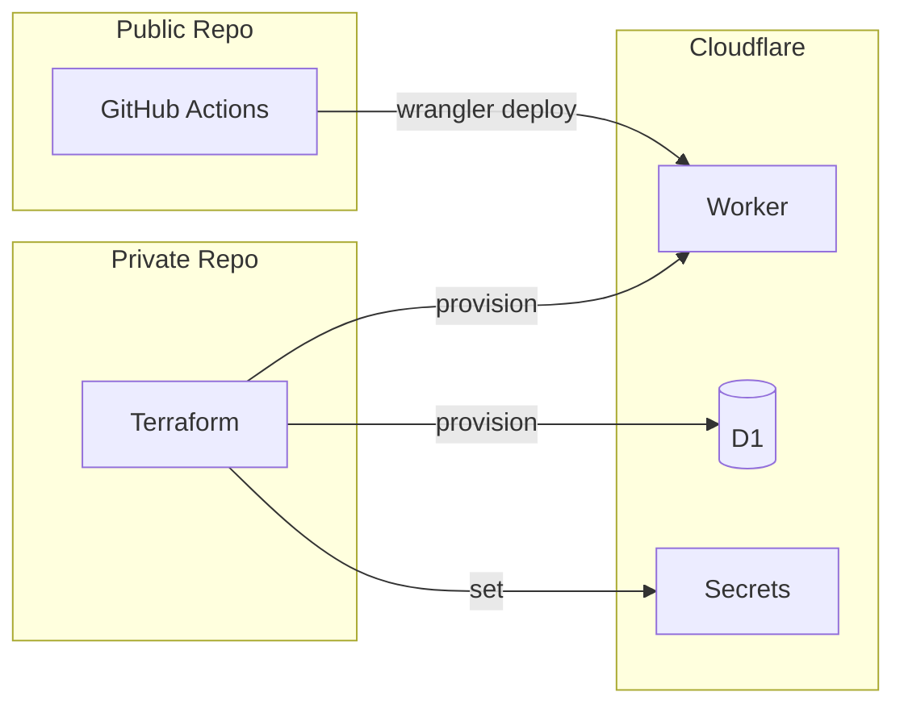

# Infrastructure & Deployment

## リポジトリ構成

| リポジトリ | 公開 | 内容 |
|-----------|------|------|
| think-graph | Public | アプリコード |
| think-graph-infra | Private | Terraform、tfvars、state |

## デプロイフロー



**Terraform (Private):**
- Worker作成
- D1データベース作成
- Secrets設定 (GOOGLE_CLIENT_ID, GOOGLE_CLIENT_SECRET, JWT_SECRET)

**App CI/CD (Public):**
- `wrangler deploy` でコードのみデプロイ
- シークレットはTerraform管理済みのものを参照

## 環境管理

| 環境 | シークレット管理 | OAuth Client |
|------|-----------------|--------------|
| ローカル | `.dev.vars` (gitignore) | think-graph-local |
| 本番 | Terraform → Cloudflare | think-graph-prod |

## ローカル開発

```bash
# packages/core/.dev.vars
GOOGLE_CLIENT_ID=xxxxx.apps.googleusercontent.com
GOOGLE_CLIENT_SECRET=GOCSPX-xxxxx
JWT_SECRET=local-dev-secret
```

`wrangler.jsonc` の `database_id: "local"` はローカル開発用。本番値はTerraformが注入。

## Terraform例

```hcl
# Cloudflare Provider
resource "cloudflare_worker_script" "api" {
  account_id = var.cloudflare_account_id
  name       = "think-graph"
  content    = file("${path.module}/worker.js")
}

resource "cloudflare_worker_secret" "google_client_id" {
  account_id  = var.cloudflare_account_id
  script_name = cloudflare_worker_script.api.name
  name        = "GOOGLE_CLIENT_ID"
  secret_text = var.google_client_id
}

resource "cloudflare_worker_secret" "google_client_secret" {
  account_id  = var.cloudflare_account_id
  script_name = cloudflare_worker_script.api.name
  name        = "GOOGLE_CLIENT_SECRET"
  secret_text = var.google_client_secret
}

resource "cloudflare_worker_secret" "jwt_secret" {
  account_id  = var.cloudflare_account_id
  script_name = cloudflare_worker_script.api.name
  name        = "JWT_SECRET"
  secret_text = var.jwt_secret
}

resource "cloudflare_d1_database" "main" {
  account_id = var.cloudflare_account_id
  name       = "think-graph-db"
}
```

## wrangler.jsonc (ローカル開発用)

```jsonc
{
  "$schema": "node_modules/wrangler/config-schema.json",
  "name": "core",
  "compatibility_date": "2025-08-03",
  "main": "./src/index.tsx",
  "d1_databases": [
    {
      "binding": "DB",
      "database_name": "think-graph-db",
      "database_id": "local"  // ローカル用ダミー値
    }
  ]
}
```
